# <span lang="zh">Pokemmo Alpha 头目监控面板</span> <span lang="en">Pokemmo Alpha Boss Monitor Panel</span>

<p align="center">
  <strong><span lang="zh">多源监控 · 投票裁决 · 跨源去重 · 决策 · 分发</span></strong>
  <br>
  <span lang="en">Multi-source Monitor · Vote · Cross-source Dedup · Decide · Dispatch</span>
</p>

<p align="center">
  <a href="#-简介-introduction"><span lang="zh">简介</span> <span lang="en">Introduction</span></a> •
  <a href="#-运行原理-architecture"><span lang="zh">运行原理</span> <span lang="en">Architecture</span></a> •
  <a href="#-截图-screenshots"><span lang="zh">截图</span> <span lang="en">Screenshots</span></a> •
  <a href="#-部署-deployment"><span lang="zh">部署</span> <span lang="en">Deployment</span></a> •
  <a href="#-接入指南-plugin-guide"><span lang="zh">接入指南</span> <span lang="en">Plugin Guide</span></a> •
  <a href="#-默认队伍-default-team"><span lang="zh">默认队伍</span> <span lang="en">Default Team</span></a> •
  <a href="#-致谢-credits"><span lang="zh">致谢</span> <span lang="en">Credits</span></a>
</p>

---

## <span lang="zh">简介</span> <span lang="en">Introduction</span>

<span lang="zh">

**Alpha 分发决策面板** 是一个 Pokemmo 头目（Alpha）自动监控与播报系统。它会同时盯着多个数据源，通过投票裁决判断哪个头目信息是可信的，跨源去重避免重复推送，再由可插拔的决策器生成打法推荐，最终分发到你配置的各个渠道（WxPusher、Webhook 等）。

核心特性：
- **多源并发监控** —— 同时轮询多个数据源，一个挂了不影响其他
- **投票裁决机制** —— 多源结果不一致时，按内容指纹投票，多数胜出
- **跨源全局去重** —— 同一头目无论被几个源报到，只推一次
- **可插拔决策器** —— 打法引擎可替换、可扩展，支持上传自定义分发器
- **中英双语** —— 面板、推送内容均支持中文 / 英文 / 双语切换
- **Web 管理面板** —— Flask + 原生 JS SPA，含调试、定时、日志等分页

</span>

<span lang="en">

The **Alpha Dispatch Decision Panel** is an automated Pokemmo alpha-boss monitoring and broadcasting system. It watches multiple data sources concurrently, uses voting to determine which alpha report is trustworthy, deduplicates across sources to avoid duplicate pushes, then uses pluggable deciders to generate strategy recommendations and dispatches to your configured channels (WxPusher, Webhook, etc.).

Key features:
- **Multi-source concurrent monitoring** — polls multiple sources at once; one down doesn't affect others
- **Voting mechanism** — when sources disagree, content fingerprint voting decides the winner
- **Cross-source global dedup** — same alpha reported by multiple sources → pushed only once
- **Pluggable deciders** — strategy engine is replaceable & extensible; upload custom dispatchers
- **Bilingual support** — panel & push content support Chinese / English / bilingual mode
- **Web management panel** — Flask + vanilla JS SPA with debug, scheduler, logs pages

</span>

---

## <span lang="zh">运行原理</span> <span lang="en">Architecture</span>

### <span lang="zh">系统流程图</span> <span lang="en">System Flow Diagram</span>

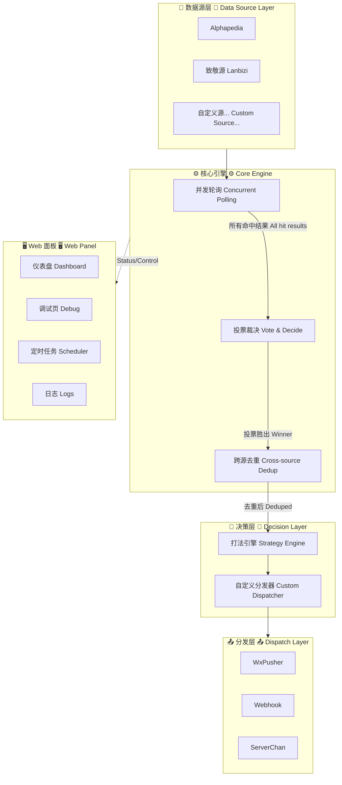

### <span lang="zh">五步处理流程</span> <span lang="en">Five-Step Pipeline</span>

| <span lang="zh">步骤</span> <span lang="en">Step</span> | <span lang="zh">说明</span> <span lang="en">Description</span> |
|---|---|
| ① <span lang="zh">多源监控</span> <span lang="en">Monitor</span> | <span lang="zh">并发轮询所有已启用数据源，超时/报错的源直接跳过，不阻塞其他源</span> <span lang="en">Poll all enabled sources concurrently; timeout/error sources are skipped without blocking others</span> |
| ② <span lang="zh">投票裁决</span> <span lang="en">Vote</span> | <span lang="zh">多源结果按「图鉴ID+特性+技能」算指纹分组计票，得票最多者胜出；平票按时间最新→优先级最小兜底</span> <span lang="en">Group results by fingerprint (dex ID + ability + moves), majority wins; tie-break: newest timestamp → lowest priority</span> |
| ③ <span lang="zh">跨源去重</span> <span lang="en">Dedupe</span> | <span lang="zh">全局去重键 = 头目指纹 @ 时间分桶(10min)，同一时段只推一次</span> <span lang="en">Global dedup key = fingerprint @ time bucket (10min), each slot pushed once</span> |
| ④ <span lang="zh">决策</span> <span lang="en">Decide</span> | <span lang="zh">由决策器（Strategy Engine）生成打法推荐：队伍选择、配招顺序、干扰技判定等</span> <span lang="en">Decider (Strategy Engine) generates strategy: team selection, move order, status-move detection, etc.</span> |
| ⑤ <span lang="zh">分发</span> <span lang="en">Dispatch</span> | <span lang="zh">推送到所有已启用渠道（WxPusher/Webhook/ServerChan），任一成功即算完成</span> <span lang="en">Push to all enabled channels; any single success counts as delivered</span> |

### <span lang="zh">目录结构</span> <span lang="en">Directory Structure</span>

```
pokemmo_alpha/
├── config/
│   ├── settings.yaml       # <span lang="zh">语言、推送、重试、去重、日志配置</span>
│   │                       # <span lang="en">Language, push, retry, dedup, logging config</span>
│   ├── sources.yaml        # <span lang="zh">数据源注册表（增删改源就改这里）</span>
│   │                       # <span lang="en">Source registry (add/remove sources here)</span>
│   └── rules.yaml          # <span lang="zh">技能名单、队伍配置、白名单、输出模板</span>
│                           # <span lang="en">Move lists, team config, whitelist, output templates</span>
├── data/
│   ├── pokedex.json        # <span lang="zh">多语言图鉴（1025精灵+374特性+937技能）</span>
│   │                       # <span lang="en">Multilingual dex (1025 Pokémon + 374 abilities + 937 moves)</span>
│   └── aliases.json        # <span lang="zh">别名表：机翻名→官方名</span>
│                           # <span lang="en">Alias table: machine-translated → official names</span>
├── src/
│   ├── core/               # <span lang="zh">模型、图鉴、去重、推送、配置</span>
│   │                       # <span lang="en">Models, pokedex, dedup, notify, config</span>
│   ├── sources/            # <span lang="zh">数据源适配器（一个源一个文件）</span>
│   │                       # <span lang="en">Data source adapters (one file per source)</span>
│   │   ├── base.py         # <span lang="zh">基类（重试/超时/转发/4xx提示）</span>
│   │   │                   # <span lang="en">Base class (retry/timeout/proxy/4xx hints)</span>
│   │   ├── alphapedia.py   # Alphapedia <span lang="zh">适配器</span> <span lang="en">adapter</span>
│   │   └── lanbizi.py      # <span lang="zh">致敬源适配器（中英双语模板）</span>
│   │                       # <span lang="en">Tribute source adapter (bilingual template)</span>
│   ├── strategy/           # <span lang="zh">规则加载 + 打法引擎</span>
│   │                       # <span lang="en">Rule loading + strategy engine</span>
│   └── main.py             # <span lang="zh">主流程入口</span> <span lang="en">Main entry point</span>
├── panel/
│   ├── app.py              # <span lang="zh">Flask Web 面板</span> <span lang="en">Flask web panel</span>
│   ├── dispatchers/        # <span lang="zh">内置/用户上传的分发器</span>
│   │                       # <span lang="en">Built-in / user-uploaded dispatchers</span>
│   │   ├── default_dispatcher.py
│   │   └── example_dispatcher.py  # <span lang="zh">示例分发器（带队伍提示）</span>
│   │                          # <span lang="en">Example dispatcher (with team hints)</span>
│   ├── static/             # <span lang="zh">前端静态资源（JS/CSS/HTML）</span>
│   │                       # <span lang="en">Frontend static assets (JS/CSS/HTML)</span>
│   └── db.py               # <span lang="zh">SQLite 数据库操作</span>
│                           # <span lang="en">SQLite database operations</span>
├── tools/
│   └── build_pokedex.py    # <span lang="zh">从 PokeAPI 生成/更新图鉴数据</span>
│                           # <span lang="en">Build/update pokedex data from PokeAPI</span>
├── tests/                  # <span lang="zh">回归测试</span> <span lang="en">Regression tests</span>
├── Dockerfile              # <span lang="zh">Docker 镜像构建</span> <span lang="en">Docker image build</span>
├── run.py                  # <span lang="zh">面板入口（给定时任务用）</span>
│                           # <span lang="en">Panel entry point (for scheduled tasks)</span>
└── requirements*.txt       # <span lang="zh">Python 依赖</span> <span lang="en">Python dependencies</span>
```

---

## <span lang="zh">截图</span> <span lang="en">Screenshots</span>

<span lang="zh">以下是面板与默认队伍的截图展示：</span> <span lang="en">Below are screenshots of the panel and default team:</span>

### <span lang="zh">Web 面板预览</span> <span lang="en">Web Panel Preview</span>

<span lang="zh">以下为面板在 VPS 上真实运行的截图：</span> <span lang="en">Live panel screenshots running on a VPS:</span>

**<span lang="zh">登录页</span> <span lang="en">Login</span>**
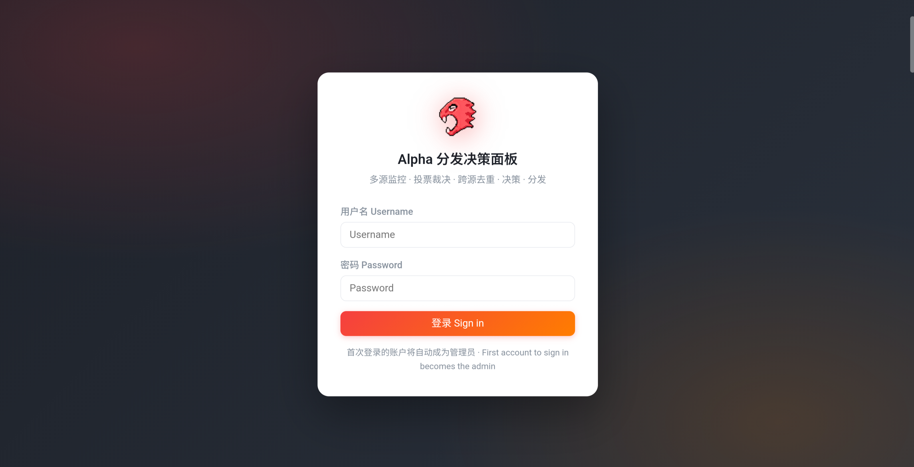

**<span lang="zh">仪表盘</span> <span lang="en">Dashboard</span>**
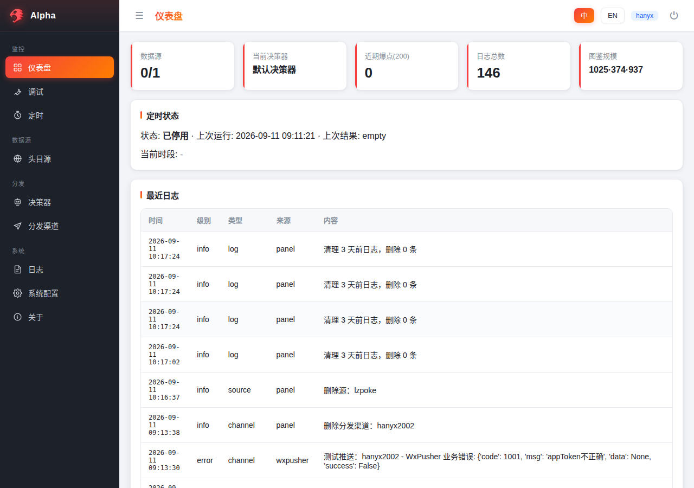

**<span lang="zh">关于页</span> <span lang="en">About</span>**
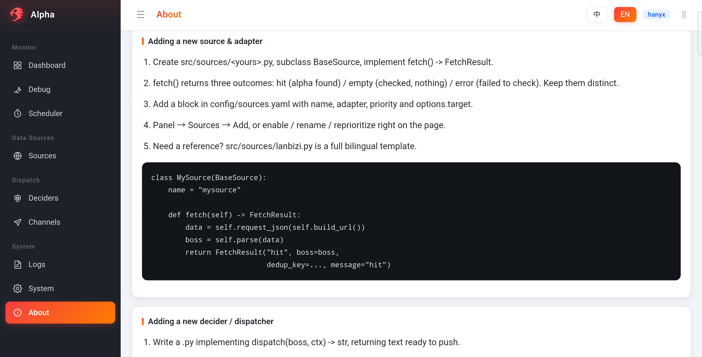

**<span lang="zh">头目源管理</span> <span lang="en">Source Management</span>**
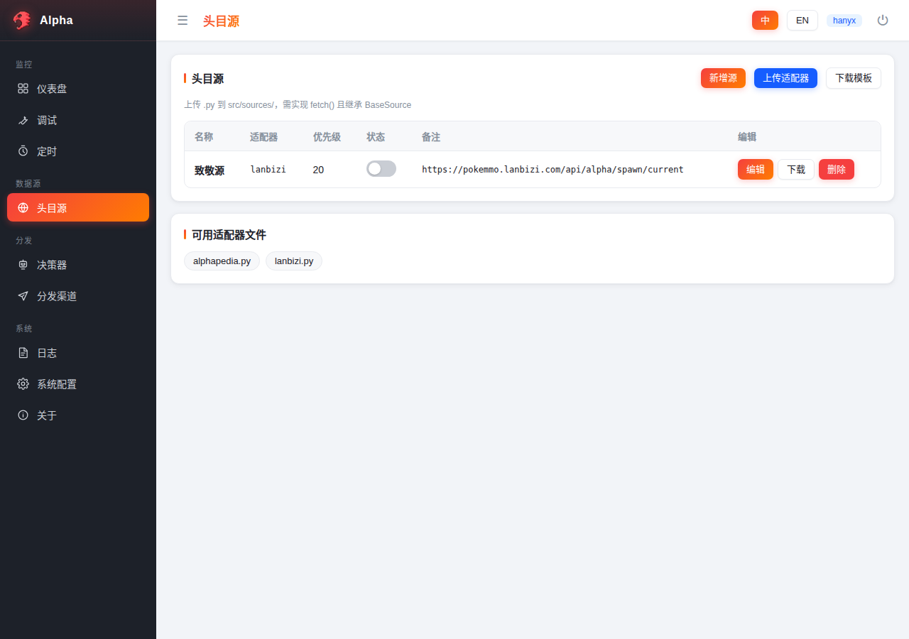

**<span lang="zh">调试页</span> <span lang="en">Debug</span>**
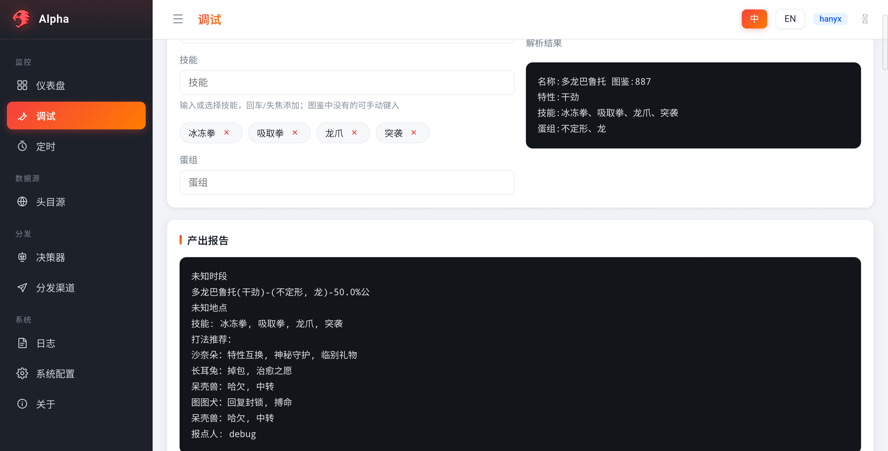

**<span lang="zh">定时任务</span> <span lang="en">Scheduler</span>**
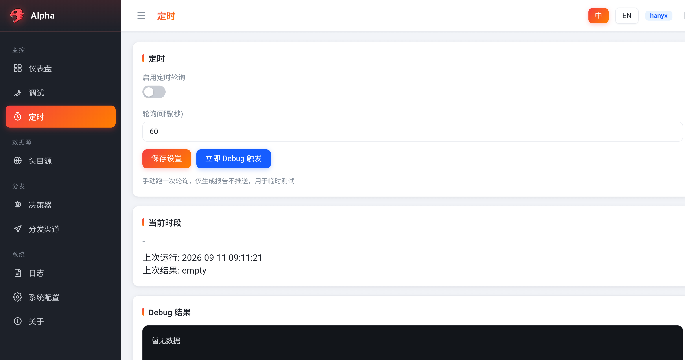

### <span lang="zh">默认队伍配置</span> <span lang="en">Default Team Configuration</span>

<span lang="zh">默认队伍由 6 只精灵组成，针对不同头目特性自动切换应对方案：</span>
<span lang="en">The default team consists of 6 Pokémon, automatically switching counter-strategies based on boss abilities:</span>

| <span lang="zh">位置</span> <span lang="en">Slot</span> | <span lang="zh">精灵</span> <span lang="en">Pokémon</span> | <span lang="zh">角色</span> <span lang="en">Role</span> | <span lang="zh">截图</span> <span lang="en">Screenshot</span> |
|:---:|---|---|---|
| 1 | <span lang="zh">沙奈朵</span> <span lang="en">Gardevoir</span> | <span lang="zh">辅助戏法手</span> <span lang="en">Secondary Trick Setter / Status</span> | 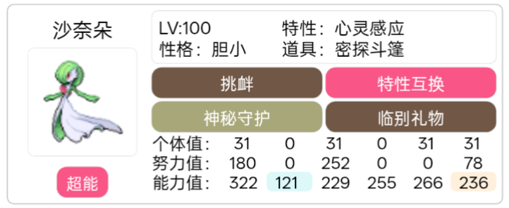 |
| 2 | <span lang="zh">长耳兔</span> <span lang="en">Lopunny</span> | <span lang="zh">主戏法手</span> <span lang="en">Primary Trick Setter Setter</span> | 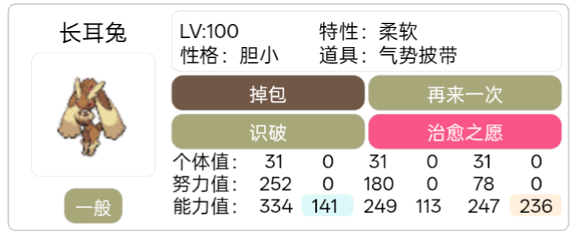 |
| 3 | <span lang="zh">图图犬</span> <span lang="en">Smeargle</span> | <span lang="zh">万能工具人</span> <span lang="en">All-Round Utility</span> | 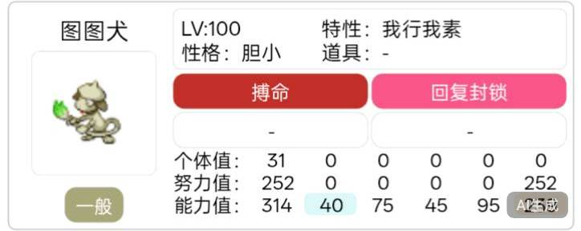 |
| 4 | <span lang="zh">呆壳兽</span> <span lang="en">Slowbro</span> | <span lang="zh">中转 </span> <span lang="en">Pivot </span> | 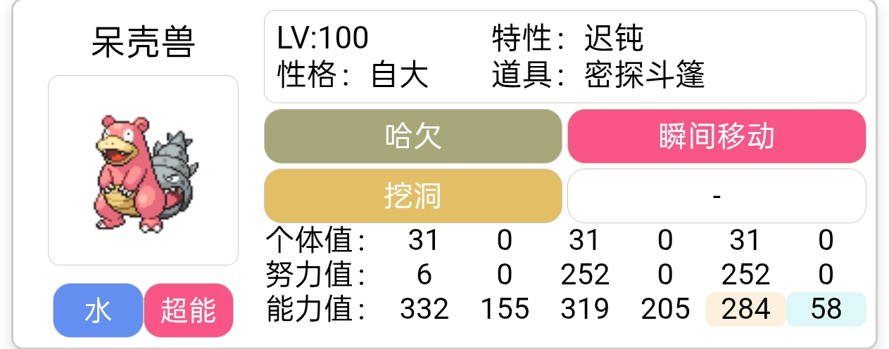 |
| 5 | <span lang="zh">索罗亚克</span> <span lang="en">Zoroark</span> | <span lang="zh">反恶作剧之心戏法手</span> <span lang="en">Prankster-Proof Trick Setter</span> | 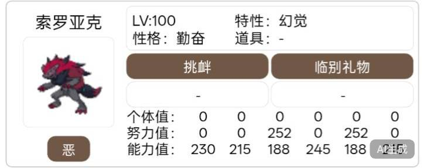 |
| 6 | <span lang="zh">月亮伊布</span> <span lang="en">Umbreon</span> | <span lang="zh">反恶作剧之心戏法手</span> <span lang="en">Prankster-Proof Piovt</span> | 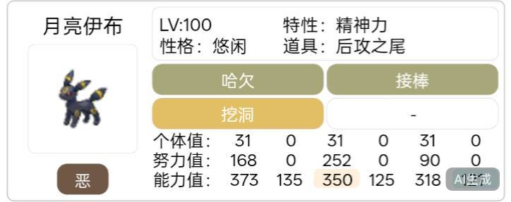 |

#### <span lang="zh">队伍切换逻辑</span> <span lang="en">Team Switching Logic</span>

<span lang="zh">

- **默认队伍**：`沙奈朵 + 长耳兔 + 图图犬 + 呆壳兽`
- **恶作剧之心队伍**（头目是利欧路/勾魂眼/黑暗鸦/风妖精 或带恶作剧之心特性时）：`索罗亚克 + 长耳兔 + 图图犬 + 月亮伊布`
- **中转手插入**（头目带先制技或回复技时）：在队伍中自动插入中转手

</span>

<span lang="en">

- **Default team**: `Gardevoir + Lopunny + Smeargle + Slowbro`
- **Prankster team** (boss is Riolu/Sableye/Murkrow/Whimsicott or has Prankster): `Zoroark + Lopunny + Smeargle + Umbreon`
- **Pivot insertion** (boss has priority or recovery moves): auto-insert pivot into team

</span>

---

## <span lang="zh">部署</span> <span lang="en">Deployment</span>

### <span lang="zh">方式一：直接运行</span> <span lang="en">Method 1: Direct Run</span>

<span lang="zh">

#### 后端引擎（CLI）

</span>

<span lang="en">

#### Backend Engine (CLI)

</span>

```bash
# <span lang="zh">克隆项目</span> <span lang="en">Clone the repo</span>
git clone https://github.com/hanx11192-ship-it/pokemmo_alpha.git
cd pokemmo_alpha

# <span lang="zh">安装依赖</span> <span lang="en">Install dependencies</span>
pip3 install -r requirements.txt

# <span lang="zh">离线试跑（不推送、不写标记）</span> <span lang="en">Dry run (no push, no dedup marks)</span>
python3 -m src.main --dry-run --sample tests/samples/salamence_dual_gender.json

# <span lang="zh">真实运行</span> <span lang="en">Run for real</span>
export WXPUSHER_APP_TOKEN_alpha=your_token
export transfor_url=https://your-proxy-service/
python3 -m src.main
```

<span lang="zh">

#### Web 面板

</span>

<span lang="en">

#### Web Panel

</span>

```bash
# <span lang="zh">安装面板依赖</span> <span lang="en">Install panel dependencies</span>
pip3 install -r requirements-panel.txt

# <span lang="zh">启动面板（默认 :5000）</span> <span lang="en">Start panel (default :5000)</span>
python3 panel/app.py

# <span lang="zh">或指定端口</span> <span lang="en">Or specify port</span>
PORT=8080 python3 panel/app.py
```

### <span lang="zh">方式二：Docker 部署</span> <span lang="en">Method 2: Docker Deployment</span>

```bash
# <span lang="zh">构建镜像</span> <span lang="en">Build image</span>
docker build -t pokemmo-alpha-panel .

# <span lang="zh">运行容器</span> <span lang="en">Run container</span>
docker run -d \
  -p 5000:5000 \
  -e PANEL_SECRET=your-secret-key \
  -v $(pwd)/data:/app/data \
  -v $(pwd)/config:/app/config \
  --name alpha-panel \
  pokemmo-alpha-panel
```

### <span lang="zh">方式三：systemd 服务（VPS 推荐）</span> <span lang="en">Method 3: systemd Service (Recommended for VPS)</span>

<span lang="zh">创建 `/etc/systemd/system/pokemmo-panel.service`：</span>
<span lang="en">Create `/etc/systemd/system/pokemmo-panel.service`:</span>

```ini
[Unit]
Description=Pokemmo Alpha Monitor Panel
After=network.target

[Service]
Type=simple
User=root
WorkingDirectory=/path/to/pokemmo_alpha
EnvironmentFile=/path/to/pokemmo_alpha/panel.env
ExecStart=/usr/bin/python3 panel/app.py
Restart=always
RestartSec=5

[Install]
WantedBy=multi-user.target
```

<span lang="zh">

然后：

</span>

<span lang="en">

Then:

</span>

```bash
sudo systemctl daemon-reload
sudo systemctl enable pokemmo-panel
sudo systemctl start pokemmo-panel
```

### <span lang="zh">环境变量</span> <span lang="en">Environment Variables</span>

| <span lang="zh">变量</span> <span lang="en">Variable</span> | <span lang="zh">说明</span> <span lang="en">Description</span> | <span lang="zh">必填</span> <span lang="en">Required</span> |
|---|---|:---:|
| `PANEL_SECRET` | <span lang="zh">面板会话密钥</span> <span lang="en">Panel session secret</span> | <span lang="zh">是</span> <span lang="en">Yes</span> |
| `PORT` | <span lang="zh">监听端口（默认 5000）</span> <span lang="en">Listen port (default 5000)</span> | <span lang="zh">否</span> <span lang="en">No</span> |
| `transfor_url` | <span lang="zh">代理转发服务地址</span> <span lang="en">Proxy forward service URL</span> | <span lang="zh">视网络情况</span> <span lang="en">Depends on network</span> |
| `PROXY_KEY` | <span lang="zh">代理转发密钥</span> <span lang="en">Proxy forward key</span> | <span lang="zh">配转发服务时必填</span> <span lang="en">If using proxy</span> |
| `WXPUSHER_APP_TOKEN_alpha` | <span lang="zh">WxPusher 推送 Token</span> <span lang="en">WxPusher push token</span> | <span lang="zh">使用 WxPusher 时</span> <span lang="en">When using WxPusher</span> |
| `HTTPS_PROXY` | <span lang="zh">HTTP(S) 代理地址</span> <span lang="en">HTTP(S) proxy address</span> | <span lang="zh">否</span> <span lang="en">No</span> |

### <span lang="zh">定时任务</span> <span lang="en">Scheduled Tasks</span>

<span lang="zh">面板内置定时器（设置 → 定时任务），也支持系统 crontab：</span>
<span lang="en">The panel has a built-in scheduler (Settings → Scheduler). System crontab is also supported:</span>

```cron
# <span lang="zh">每分钟执行一次轮询</span> <span lang="en">Poll every minute</span>
* * * * * cd /path/to/pokemmo_alpha && python3 -m src.main >> /dev/null 2>&1
```

---

## <span lang="zh">接入指南</span> <span lang="en">Plugin Guide</span>

### <span lang="zh">新增数据源与适配器</span> <span lang="en">Adding a New Source & Adapter</span>

<span lang="zh">

**步骤：**

1. 在 `src/sources/` 下新建 `<你的源>.py`，继承 `BaseSource`，实现 `fetch() -> FetchResult`
2. `fetch()` 返回三种结果：`hit`（有头目）/ `empty`（没有）/ `error`（失败）
3. 在 `config/sources.yaml` 里加一段配置
4. 面板 → 头目源 → 新增源，或直接编辑 YAML

</span>

<span lang="en">

**Steps:**

1. Create `src/sources/<yours>.py`, subclass `BaseSource`, implement `fetch() -> FetchResult`
2. `fetch()` returns three outcomes: `hit` (alpha found) / `empty` (nothing) / `error` (failed)
3. Add a block in `config/sources.yaml`
4. Panel → Sources → Add, or edit the YAML directly

</span>

<span lang="zh">**完整模板示例（中英双语）：**</span> <span lang="en">**Full template example (bilingual):**</span>

<span lang="zh">参考 `src/sources/lanbizi.py`（致敬源），它是官方推荐的适配器模板。</span>
<span lang="en">Reference `src/sources/lanbizi.py` (Tribute Source) — it's the officially recommended adapter template.</span>

```python
# -*- coding: utf-8 -*-
"""<span lang="zh">我的数据源适配器</span> <span lang="en">My Data Source Adapter</span>"""
from ..core.models import BossData, FetchResult
from .base import BaseSource


class MySource(BaseSource):
    name = "my_source"

    def fetch(self) -> FetchResult:
        # <span lang="zh">1. 拉取数据</span> <span lang="en">1. Fetch data</span>
        data = self.request_json(self.build_url())

        # <span lang="zh">2. 解析成 BossData</span> <span lang="en">2. Parse into BossData</span>
        boss = self.parse(data)

        # <span lang="zh">3. 返回结果</span> <span lang="en">3. Return result</span>
        return FetchResult("hit", boss=boss,
                           dedup_key=boss.period,
                           message=f"<span lang='zh'>命中：</span><span lang='en'>Hit:</span> {boss.name}")

    def parse(self, data: dict) -> BossData:
        # <span lang="zh">把源的数据翻译成统一的 BossData</span>
        # <span lang="en">Translate source data into normalized BossData</span>
        ...
```

<span lang="zh">**YAML 配置：**</span> <span lang="en">**YAML Config:**</span>

```yaml
sources:
  - name: my_source          # <span lang="zh">显示名称</span> <span lang="en">Display name</span>
    adapter: my_source       # <span lang="zh">对应 Python 文件名</span> <span lang="en">Corresponds to Python filename</span>
    enabled: true
    priority: 10             # <span lang="zh">数字越小越优先</span> <span lang="en">Lower = higher priority</span>
    options:
      target: https://example.com/api/alpha
      transform_url_env: transfor_dir_url  # <span lang="zh">可选：走代理转发</span> <span lang="en">Optional: use proxy</span>
      extra_lines:
        hms: true
```

### <span lang="zh">新增决策器 / 分发器</span> <span lang="en">Adding a New Decider / Dispatcher</span>

<span lang="zh">

**步骤：**

1. 写一个 `.py` 文件，实现 `dispatch(boss, ctx) -> str`
2. `boss` 是归一化后的头目数据，`ctx` 包含 `pokedex`、`rules`、`langs`
3. 面板 → 决策器 → 上传，启用后设为当前
4. 抛异常不会炸——面板会回退到内置决策器并记日志

</span>

<span lang="en">

**Steps:**

1. Write a `.py` file implementing `dispatch(boss, ctx) -> str`
2. `boss` is normalized alpha data, `ctx` contains `pokedex`, `rules`, `langs`
3. Panel → Deciders → Upload, enable it, set as active
4. Raising is safe — panel falls back to built-in decider and logs error

</span>

<span lang="zh">**参考示例：**</span> <span lang="en">**Reference example:**</span> `panel/dispatchers/example_dispatcher.py`

```python
# -*- coding: utf-8 -*-
from src.strategy.engine import generate_report, generate_bilingual

NAME = "<span lang='zh'>我的分发器</span><span lang='en'>My Dispatcher</span>"
DESCRIPTION = "<span lang='zh'>一句话描述</span><span lang='en'>One-line description</span>"


def dispatch(boss, ctx: dict) -> str:
    """<span lang='zh'>返回可直接推送的文本</span><span lang='en'>Return text ready to push</span>"""
    rules = ctx["rules"]
    pokedex = ctx["pokedex"]
    langs = ctx.get("langs") or ["zh"]

    # <span lang="zh">调用官方引擎生成基础报告</span>
    # <span lang="en">Call official engine for base report</span>
    if "zh" in langs and "en" in langs:
        text = generate_bilingual(boss, rules, pokedex, langs)
    else:
        text = generate_report(boss, rules, pokedex, langs[0])

    # <span lang="zh">追加你的自定义内容</span>
    # <span lang="en">Append your custom content</span>
    # text += f"\n<span lang='zh'>自定义提示</span><span lang='en'>Custom hint</span>"

    return text
```

### <span lang="zh">面板操作</span> <span lang="en">Panel Operations</span>

| <span lang="zh">功能</span> <span lang="en">Feature</span> | <span lang="zh">路径</span> <span lang="en">Location</span> | <span lang="zh">说明</span> <span lang="en">Description</span> |
|---|---|---|
| <span lang="zh">调试测试</span> <span lang="en">Debug Test</span> | `/debug` | <span lang="zh">构造假定头目，测试分发器输出</span> <span lang="en">Build a hypothetical boss, test dispatcher output</span> |
| <span lang="zh">管理数据源</span> <span lang="en">Manage Sources</span> | <span lang="zh">面板 → 头目源</span> <span lang="en">Panel → Sources</span> | <span lang="zh">增删改查、启停、调优先级、上传适配器</span> <span lang="en">CRUD, enable/disable, reprioritize, upload adapters</span> |
| <span lang="zh">管理分发器</span> <span lang="en">Manage Dispatchers</span> | <span lang="zh">面板 → 决策器</span> <span lang="en">Panel → Deciders</span> | <span lang="zh">上传/下载/删除/启用/切换当前</span> <span lang="en">Upload/download/delete/enable/switch active</span> |
| <span lang="zh">定时任务</span> <span lang="en">Scheduler</span> | <span lang="zh">面板 → 定时任务</span> <span lang="en">Panel → Scheduler</span> | <span lang="zh">启用/停用/调间隔/手动触发</span> <span lang="en">Enable/disable/adjust interval/manual trigger</span> |
| <span lang="zh">查看日志</span> <span lang="en">View Logs</span> | <span lang="zh">面板 → 日志</span> <span lang="en">Panel → Logs</span> | <span lang="zh">事件日志 + 源查询日志</span> <span lang="en">Event logs + source query logs</span> |
| <span lang="zh">系统配置</span> <span lang="en">System Config</span> | <span lang="zh">面板 → 系统配置</span> <span lang="en">Panel → System</span> | <span lang="zh">时区/语言/环境变量</span> <span lang="en">Timezone/language/env vars</span> |

---

## <span lang="zh">技术细节</span> <span lang="en">Technical Details</span>

### <span lang="zh">多语言实现</span> <span lang="en">Multilingual Implementation</span>

<span lang="zh">不同 API 返回的语言不一样（中文/英文/机翻），所以统一走数字 ID 解析：</span>
<span lang="en">Different APIs return different languages (CN/EN/machine-translated), so everything resolves through numeric IDs:</span>

```
<span lang="zh">任意语言的名字 → 别名表 + 图鉴 → 数字 ID → 目标语言官方名</span>
<span lang="en">Any language name → Alias table + Pokedex → Numeric ID → Target language official name</span>
```

- <span lang="zh">源提供英文字段时优先用英文查（标准名，绕开机翻）</span> <span lang="en">Prefer English fields when available (standard names, bypasses machine translation)</span>
- <span lang="zh">只给中文的源走别名表</span> <span lang="en">Chinese-only sources use alias table</span>
- <span lang="zh">查不到保留原样</span> <span lang="en">Unresolved names kept as-is</span>

### <span lang="zh">投票与去重算法</span> <span lang="en">Voting & Dedup Algorithm</span>

<span lang="zh">

**投票：**
1. 所有命中按「图鉴ID + 特性 + 地点 + 排序后技能」算指纹
2. 相同指纹的归为一组，计票
3. 得票最多的一组胜出
4. 平票时：报点时间最新 → 优先级数字最小

**去重：**
- 去重键 = `MD5(头目内容指纹)@时间分桶(10分钟)`
- 同一只头目在存活期内（~75分钟）只推一次
- 头目刷新后（新报点时间）视为新事件

</span>

<span lang="en">

**Voting:**
1. All hits fingerprinted by `Dex ID + Ability + Location + Sorted Moves`
2. Same fingerprint → grouped together, counted
3. Majority group wins
4. Tie-break: newest timestamp → lowest priority number

**Dedup:**
- Dedup key = `MD5(content fingerprint)@time_bucket(10min)`
- Same alpha pushed only once during its lifespan (~75 min)
- Alpha refresh (new timestamp) treated as new event

</span>

---

## <span lang="zh">致谢</span> <span lang="en">Credits</span>

| <span lang="zh">贡献者</span> <span lang="en">Contributor</span> | <span lang="zh">说明</span> <span lang="en">Description</span> |
|---|---|
| <span lang="zh">蓝鼻子 (Lanbizi)</span> | <span lang="zh">国内首个公开头目 API 数据源。</span> <span lang="en">The first public alpha-boss API source in China. </span> |
| [PokeAPI](https://pokeapi.co/) | <span lang="zh">公开免费的宝可梦数据 API，提供完整的图鉴/特性/技能/蛋组数据。</span> <span lang="en">Free and open Pokémon data API providing complete Pokédex/ability/move/egg-group data.</span> |
| <span lang="zh">自愿报点的玩家</span> <span lang="en">Players who report spawns</span> | <span lang="zh">一切信息的源头。</span> <span lang="en">The origin of all information.</span> |
| <span lang="zh">俺和DeepSeek🤗</span> | <span lang="zh">本项目作者，默认决策器与分发器的提供者。</span> <span lang="en">Project author, provider of the default decider and dispatchers.</span> |

---

## <span lang="zh">免责声明</span> <span lang="en">Disclaimer</span>

<span lang="zh">本项目仅用于学习研究目的。请遵守 Pokemmo 用户协议。数据源依赖第三方公开接口，接口变动可能导致功能失效。</span>

<span lang="en">This project is for educational and research purposes only. Please follow the Pokemmo Terms of Service. Data sources depend on third-party public APIs which may change without notice.</span>

---

## <span lang="zh">许可证</span> <span lang="en">License</span>

<span lang="zh">本项目基于 MIT 许可证开源。</span> <span lang="en">This project is open-sourced under the MIT License.</span>

