# <span lang="zh">Pokemmo Alpha 头目监控面板</span> <span lang="en">Pokemmo Alpha Boss Monitor Panel</span>

<p align="center">
  <strong><span lang="zh">并发轮询 · 命中即播报 · 冲突投票 · 跨源去重 · 决策 · 分发</span></strong>
  <br>
  <span lang="en">Multi-source Monitor · Vote · Cross-source Dedup · Decide · Dispatch</span>
</p>

<p align="center">
  <a href="https://anexample.top/demo-site/"><strong><span lang="zh">前端演示站点</span> <span lang="en">Live Demo</span></strong></a>
  <br>
  <span lang="zh">（后端演示服务器是白嫖来的，随时可能暴毙，请勿依赖）</span>
  <span lang="en">(The demo backend is a freebie server — it may go down at any time.)</span>
</p>

<p align="center">
  <span lang="zh">自用推送 QQ 群：<strong>857597325</strong></span>
  <br>
  <span lang="en">Push-notification QQ group: <strong>857597325</strong></span>
</p>

---

## <span lang="zh">简介</span> <span lang="en">Introduction</span>

<span lang="zh">

**Alpha 分发决策面板** 是一个 Pokemmo 头目（Alpha）自动监控与播报系统。它会同时盯着多个数据源，**每轮并发轮询、任意一个源命中即立即播报**，仅在多源命中且报了不同头目时才按指纹投票裁决；跨源去重避免重复推送，再由打法引擎生成打法推荐与自动评分，经可插拔的决策器（分发器）分发，最终送达你配置的各个渠道（WxPusher、Webhook 等）。
示例通知q群：857597325。

核心特性：
- **多源并发监控** —— 同时轮询多个数据源，一个挂了不影响其他
- **命中即播报 + 冲突投票** —— 任一轮只要有源命中就立即播报（无需等齐多源）；多源命中且报了不同头目时，才按内容指纹计票、得票多者胜出
- **跨源全局去重** —— 同一头目无论被几个源报到，只推一次
- **可插拔决策器 / 评估器** —— Rhai 沙箱脚本，面板上传即用；内置决策器转发官方打法引擎，内置评估器自动输出「评分 + 评语」行
- **中英双语** —— 面板、推送内容均支持中文 / 英文 / 双语切换
- **Web 管理面板** —— Rust/Axum 后端 + 原生 JS SPA，含调试、插件、渠道、定时、日志、系统配置等分页
- **单二进制部署** —— 无 Python 环境依赖，内存占用约 6 MB，一条安装脚本完成从零部署

</span>

<span lang="en">

The **Alpha Dispatch Decision Panel** is an automated Pokemmo alpha-boss monitoring and broadcasting system. It watches multiple data sources concurrently; **any source that hits in a poll round is broadcast immediately**, and only when sources report conflicting (different) bosses does fingerprint voting decide the winner. It deduplicates across sources to avoid duplicate pushes, then the strategy engine generates strategy recommendations with automatic scoring, which are dispatched through the pluggable decider (dispatcher) to your configured channels (WxPusher, Webhook, etc.).

Key features:
- **Multi-source concurrent monitoring** — polls multiple sources at once; one down doesn't affect others
- **Hit-broadcast + conflict voting** — any hit in a round is broadcast immediately (no need to wait for all sources); when sources report different bosses, fingerprint voting picks the winner
- **Cross-source global dedup** — same alpha reported by multiple sources → pushed only once
- **Pluggable dispatchers / evaluators** — Rhai sandbox scripts, upload via the panel; the built-in dispatcher forwards the official strategy engine, the built-in evaluator appends an automatic "score + comment" line
- **Bilingual support** — panel & push content support Chinese / English / bilingual mode
- **Web management panel** — Rust/Axum backend + vanilla JS SPA with debug, plugins, channels, scheduler, logs, and system pages
- **Single-binary deployment** — no Python runtime needed, ~6 MB memory footprint, one install script from zero

</span>

---

## <span lang="zh">运行原理</span> <span lang="en">Architecture</span>

### <span lang="zh">系统流程图</span> <span lang="en">System Flow Diagram</span>

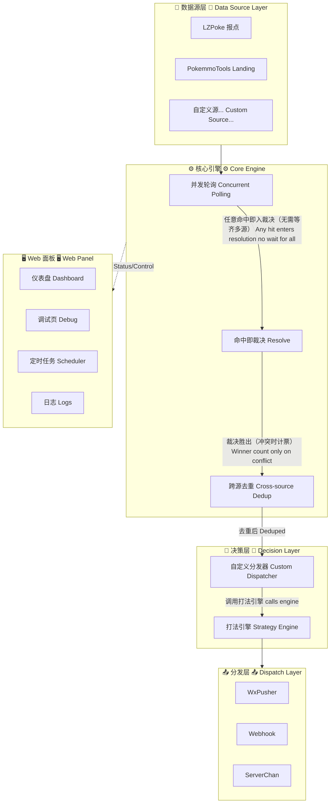
```mermaid
flowchart TB
    subgraph Sources["<span lang='zh'>📡 数据源层</span> <span lang='en'>📡 Data Source Layer</span>"]
        S1[LZPoke 报点]
        S2[PokemmoTools Landing]
        S3[<span lang='zh'>自定义源...</span> <span lang='en'>Custom Source...</span>]
    end

    subgraph Core["<span lang='zh'>⚙️ 核心引擎</span> <span lang='en'>⚙️ Core Engine</span>"]
        C1[<span lang='zh'>并发轮询</span> <span lang='en'>Concurrent Polling</span>]
        C2[<span lang='zh'>命中即裁决</span> <span lang='en'>Resolve</span>]
        C3[<span lang='zh'>跨源去重</span> <span lang='en'>Cross-source Dedup</span>]
    end

    subgraph Strategy["<span lang='zh'>🧠 决策层</span> <span lang='en'>🧠 Decision Layer</span>"]
        D1[<span lang='zh'>打法引擎</span> <span lang='en'>Strategy Engine</span>]
        D2[<span lang='zh'>自定义分发器</span> <span lang='en'>Custom Dispatcher</span>]
    end

    subgraph Output["<span lang='zh'>📤 分发层</span> <span lang='en'>📤 Dispatch Layer</span>"]
        O1[WxPusher]
        O2[Webhook]
        O3[ServerChan]
    end

    subgraph Panel["<span lang='zh'>🖥️ Web 面板</span> <span lang='en'>🖥️ Web Panel</span>"]
        P1[<span lang='zh'>仪表盘</span> <span lang='en'>Dashboard</span>]
        P2[<span lang='zh'>调试页</span> <span lang='en'>Debug</span>]
        P3[<span lang='zh'>定时任务</span> <span lang='en'>Scheduler</span>]
        P4[<span lang='zh'>日志</span> <span lang='en'>Logs</span>]
    end

    Sources --> C1
    C1 -->|<span lang='zh'>任意命中即入裁决（无需等齐多源）</span> <span lang='en'>Any hit enters resolution no wait for all</span>| C2
    C2 -->|<span lang='zh'>裁决胜出（冲突时计票）</span> <span lang='en'>Winner count only on conflict</span>| C3
    C3 -->|<span lang='zh'>去重后</span> <span lang='en'>Deduped</span>| D2
    D2 -->|<span lang='zh'>调用打法引擎</span> <span lang='en'>calls engine</span>| D1
    D1 --> Output
    Core -.->|<span lang='zh'>状态/控制</span> <span lang='en'>Status/Control</span>| Panel
```

### <span lang="zh">五步处理流程</span> <span lang="en">Five-Step Pipeline</span>

| <span lang="zh">步骤</span> <span lang="en">Step</span> | <span lang="zh">说明</span> <span lang="en">Description</span> |
|---|---|
| ① <span lang="zh">多源监控</span> <span lang="en">Monitor</span> | <span lang="zh">并发轮询所有已启用数据源，超时/报错的源直接跳过，不阻塞其他源</span> <span lang="en">Poll all enabled sources concurrently; timeout/error sources are skipped without blocking others</span> |
| ② <span lang="zh">命中即播报/裁决</span> <span lang="en">Hit & Resolve</span> | <span lang="zh">轮询窗口内任一源命中立即触发（无需等齐多源）；多源命中且<b>报的是不同头目</b>时才按「图鉴ID+特性+技能」算指纹分组计票，得票最多者胜出；平票按时间最新→优先级最小兜底</span> <span lang="en">Any hit in the poll window triggers immediately (no need to wait for all sources); only when sources report different bosses are results grouped by fingerprint (dex ID + ability + moves) and the majority wins; tie-break: newest timestamp → lowest priority</span> |
| ③ <span lang="zh">跨源去重</span> <span lang="en">Dedupe</span> | <span lang="zh">全局去重键 = 图鉴号 + 时段，同一头目在存活期内（约 75 分钟）只推一次</span> <span lang="en">Global dedup key = dex ID + time slot; same alpha pushed once per lifespan (~75 min)</span> |
| ④ <span lang="zh">决策</span> <span lang="en">Decide</span> | <span lang="zh">由打法引擎（Strategy Engine）生成打法推荐：队伍选择、配招顺序、干扰技判定等，并附自动评分评语；可插拔的决策器(分发器)负责选语言、调用引擎并输出</span> <span lang="en">Strategy Engine generates strategy: team selection, move order, status-move detection, plus an automatic score/comment line; the pluggable decider (dispatcher) selects language, calls the engine, and outputs</span> |
| ⑤ <span lang="zh">分发</span> <span lang="en">Dispatch</span> | <span lang="zh">推送到所有已启用渠道（WxPusher/Webhook/ServerChan），任一成功即算完成</span> <span lang="en">Push to all enabled channels; any single success counts as delivered</span> |

### <span lang="zh">目录结构</span> <span lang="en">Directory Structure</span>

```
pokemmo-alpha/
├── bin/
│   └── alpha-server        # <span lang="zh">预编译二进制（发布包含，可直接部署）</span>
│                           # <span lang="en">Pre-built binary (shipped with releases)</span>
├── crates/                 # <span lang="zh">Rust 源码（Cargo workspace）</span>
│                           # <span lang="en">Rust sources (Cargo workspace)</span>
│   ├── alpha-server/       # <span lang="zh">HTTP 服务：路由、鉴权、静态资源托管</span>
│   │                       # <span lang="en">HTTP server: routes, auth, static assets</span>
│   ├── alpha-scheduler/    # <span lang="zh">并发轮询、投票、去重、播报编排</span>
│   │                       # <span lang="en">Concurrent polling, voting, dedup, dispatch orchestration</span>
│   ├── alpha-sources/      # <span lang="zh">数据源适配器（一个源一个模块）</span>
│   │                       # <span lang="en">Data source adapters (one module per source)</span>
│   ├── alpha-strategy/     # <span lang="zh">打法引擎（队伍/配招/干扰技判定）</span>
│   │                       # <span lang="en">Strategy engine (teams, move order, status moves)</span>
│   ├── alpha-plugin/       # <span lang="zh">Rhai 插件沙箱 + 内置决策器/评估器</span>
│   │                       # <span lang="en">Rhai plugin sandbox + built-in dispatcher/evaluator</span>
│   ├── alpha-notify/       # <span lang="zh">分发渠道（WxPusher/Webhook/ServerChan）</span>
│   │                       # <span lang="en">Dispatch channels (WxPusher/Webhook/ServerChan)</span>
│   ├── alpha-store/        # <span lang="zh">SQLite 存储与建表迁移</span>
│   │                       # <span lang="en">SQLite storage & schema migrations</span>
│   └── alpha-core/         # <span lang="zh">领域模型、图鉴、配置、去重指纹</span>
│                           # <span lang="en">Domain models, pokedex, config, dedup fingerprints</span>
├── web/                    # <span lang="zh">前端（原生 JS SPA，由二进制直接托管）</span>
│                           # <span lang="en">Frontend (vanilla JS SPA, served by the binary)</span>
├── config/
│   ├── settings.yaml       # <span lang="zh">语言、推送、重试、去重、日志配置</span>
│   │                       # <span lang="en">Language, push, retry, dedup, logging config</span>
│   ├── sources.yaml        # <span lang="zh">数据源注册表（增删改源就改这里）</span>
│   │                       # <span lang="en">Source registry (add/remove sources here)</span>
│   └── rules.yaml          # <span lang="zh">技能名单、队伍配置、白名单、输出模板</span>
│                           # <span lang="en">Move lists, team config, whitelist, output templates</span>
├── data/
│   ├── pokedex.json        # <span lang="zh">多语言图鉴（1025精灵+374特性+937技能）</span>
│   │                       # <span lang="en">Multilingual dex (1025 Pokémon + 374 abilities + 937 moves)</span>
│   └── aliases.json        # <span lang="zh">别名表：机翻名→官方名</span>
│                           # <span lang="en">Alias table: machine-translated → official names</span>
├── deploy/                 # <span lang="zh">install.sh + systemd unit + 部署文档</span>
│                           # <span lang="en">install.sh + systemd unit + deployment guide</span>
├── docs/screenshots/       # <span lang="zh">面板截图</span> <span lang="en">Panel screenshots</span>
├── fixtures/               # <span lang="zh">回归测试基准数据</span> <span lang="en">Regression baselines</span>
└── 1.0python/              # <span lang="zh">1.0 版（Python/Flask 初版）完整归档，仅供查阅，不再维护</span>
                            # <span lang="en">Full archive of v1.0 (the original Python/Flask edition), kept for reference only</span>
```

> <span lang="zh">**关于 `1.0python/`**：这是本项目初版（Python/Flask 实现）的完整归档，代码停留在停更时的状态，仅供查阅与对照，**不再维护**。当前版本为 Rust 实现，部署请直接看下文「部署」章节，与归档目录无关。</span>
>
> <span lang="en">**About `1.0python/`**: this is the complete archive of the project's first edition (Python/Flask). It is frozen as-is, kept for reference only, and **no longer maintained**. The current edition is the Rust implementation — for deployment, go straight to the "Deployment" section below; the archive is not involved.</span>

---

## <span lang="zh">截图</span> <span lang="en">Screenshots</span>

<span lang="zh">以下是面板与默认队伍的截图展示：</span> <span lang="en">Below are screenshots of the panel and default team:</span>

### <span lang="zh">Web 面板预览</span> <span lang="en">Web Panel Preview</span>

<span lang="zh">以下为面板在 VPS 上真实运行的截图：</span> <span lang="en">Live panel screenshots running on a VPS:</span>

**<span lang="zh">登录页</span> <span lang="en">Login</span>**
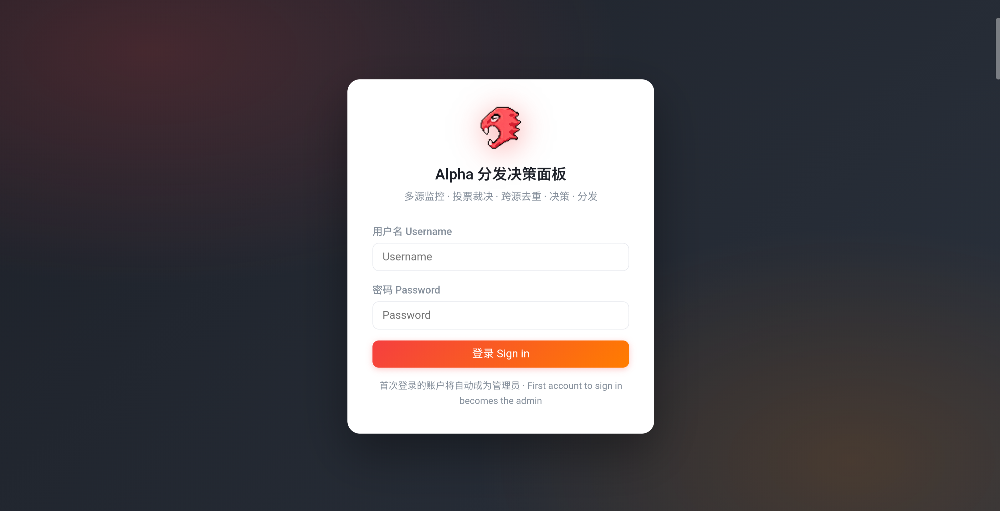

**<span lang="zh">仪表盘</span> <span lang="en">Dashboard</span>**
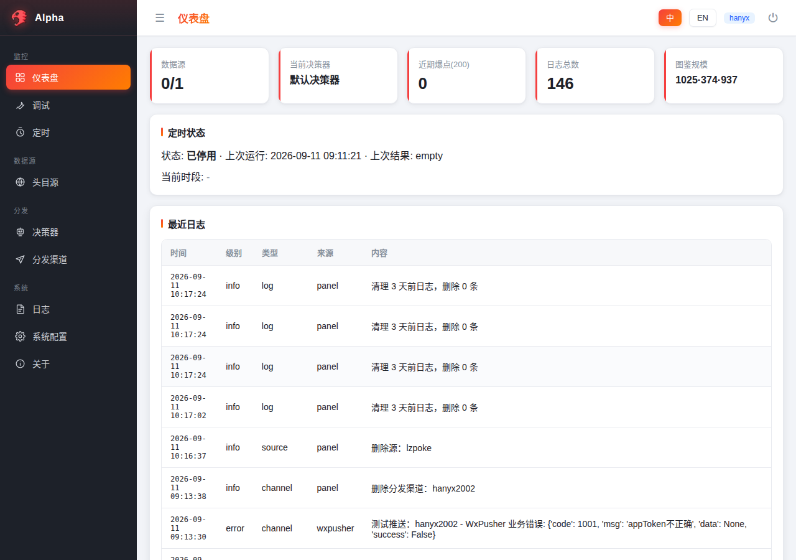


**<span lang="zh">头目源管理</span> <span lang="en">Source Management</span>**
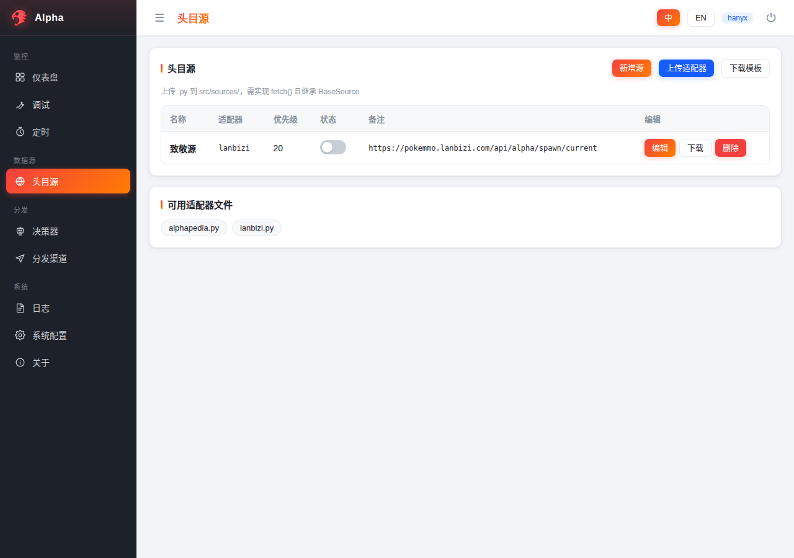

**<span lang="zh">监控定时任务</span> <span lang="en">Scheduler</span>**
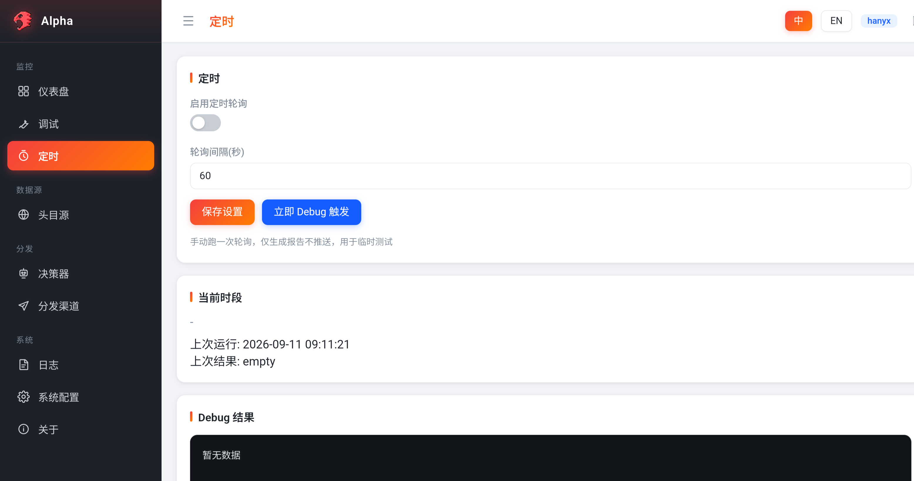

**<span lang="zh">调试页 </span> <span lang="en">Debug</span>**
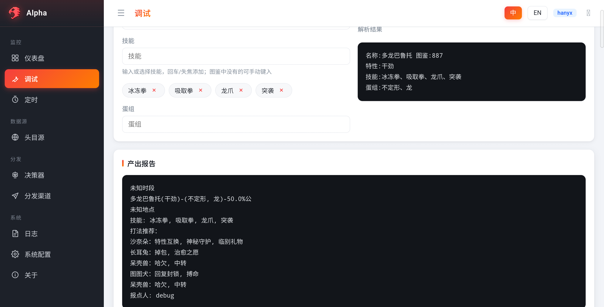

**<span lang="zh">决策器 </span> <span lang="en">Strategy-maker</span>**
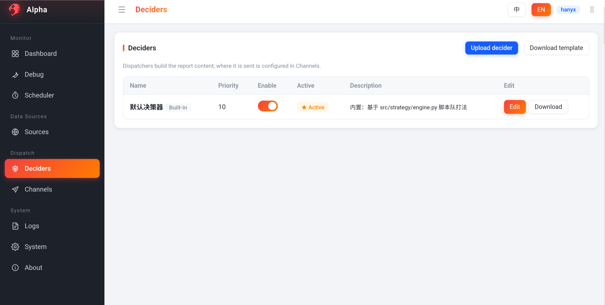

**<span lang="zh">分发渠道 </span> <span lang="en">msg channel</span>**
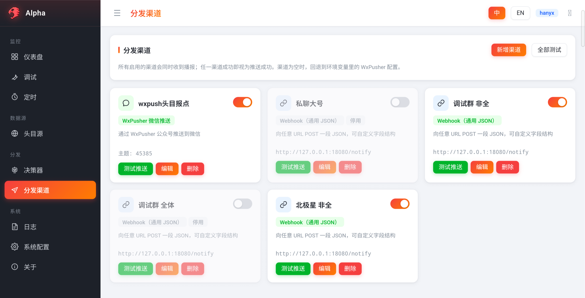

**<span lang="zh">日志 </span> <span lang="en">Log</span>**
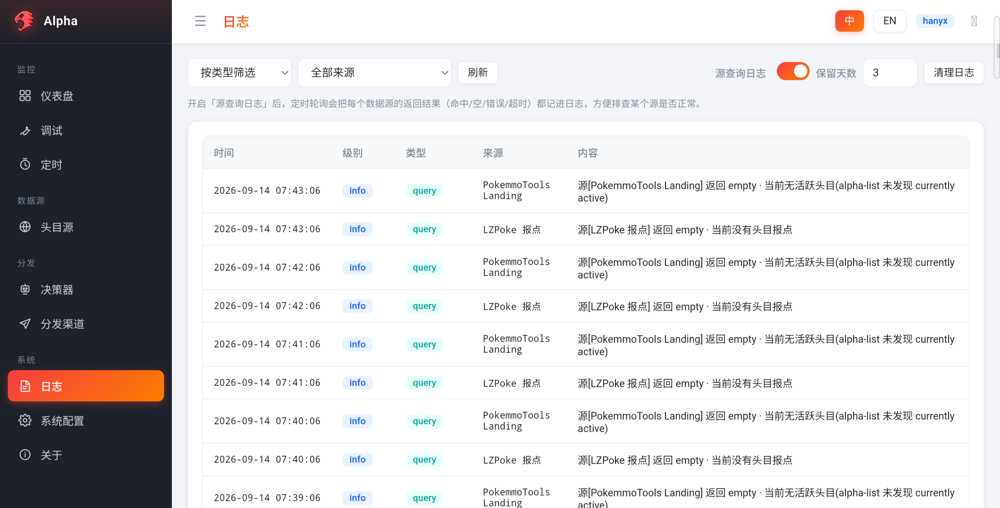

**<span lang="zh">关于页</span> <span lang="en">About</span>**
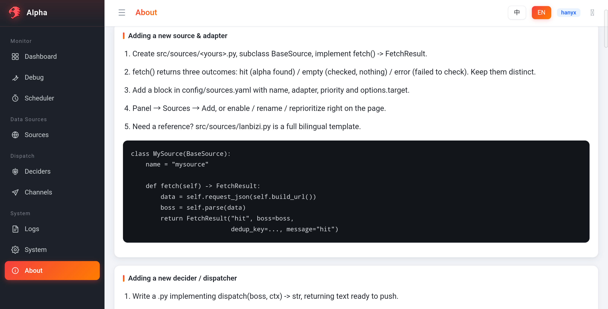


### <span lang="zh">默认队伍配置</span> <span lang="en">Default Team Configuration</span>

<span lang="zh">默认队伍由 6 只精灵组成，针对不同头目特性自动切换应对方案：</span>
<span lang="en">The default team consists of 6 Pokémon, automatically switching counter-strategies based on boss abilities:</span>

| <span lang="zh">位置</span> <span lang="en">Slot</span> | <span lang="zh">精灵</span> <span lang="en">Pokémon</span> | <span lang="zh">角色</span> <span lang="en">Role</span> | <span lang="zh">截图</span> <span lang="en">Screenshot</span> |
|:---:|---|---|---|
| 1 | <span lang="zh">沙奈朵</span> <span lang="en">Gardevoir</span> | <span lang="zh">辅助戏法手</span> <span lang="en">Secondary Trick Setter / Status</span> | 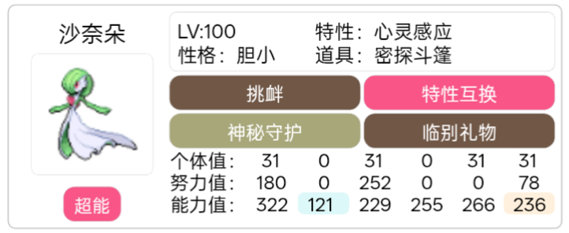 |
| 2 | <span lang="zh">长耳兔</span> <span lang="en">Lopunny</span> | <span lang="zh">主戏法手</span> <span lang="en">Primary Trick Setter Setter</span> | 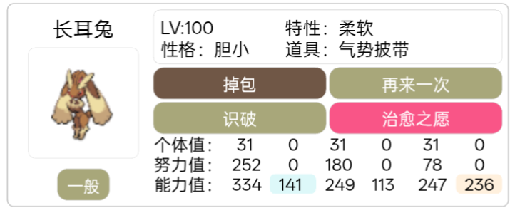 |
| 3 | <span lang="zh">图图犬</span> <span lang="en">Smeargle</span> | <span lang="zh">万能工具人</span> <span lang="en">All-Round Utility</span> | 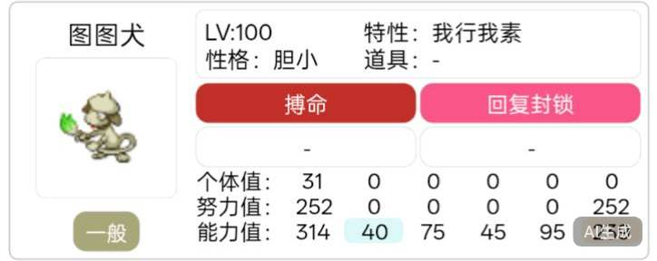 |
| 4 | <span lang="zh">呆壳兽</span> <span lang="en">Slowbro</span> | <span lang="zh">中转 </span> <span lang="en">Pivot </span> | 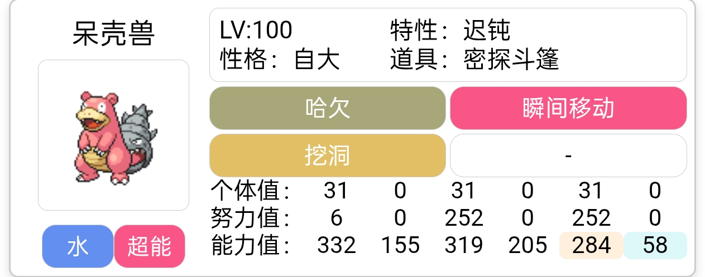 |
| 5 | <span lang="zh">索罗亚克</span> <span lang="en">Zoroark</span> | <span lang="zh">反恶作剧之心戏法手</span> <span lang="en">Prankster-Proof Trick Setter</span> | 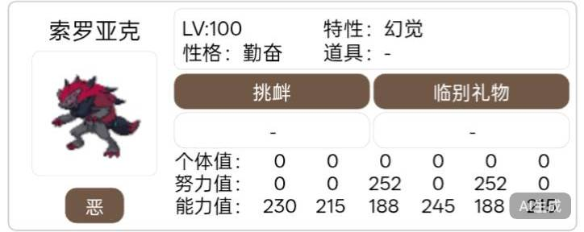 |
| 6 | <span lang="zh">月亮伊布</span> <span lang="en">Umbreon</span> | <span lang="zh">反恶作剧之心戏法手</span> <span lang="en">Prankster-Proof Piovt</span> | 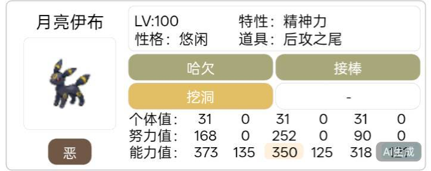 |

#### <span lang="zh">队伍切换逻辑</span> <span lang="en">Team Switching Logic</span>

<span lang="zh">

- **默认队伍**：`沙奈朵 + 长耳兔 + 图图犬 + 呆壳兽`
- **恶作剧之心队伍**（头目是利欧路/勾魂眼/黑暗鸦/风妖精 或带恶作剧之心特性时）：`索罗亚克 + 长耳兔 + 图图犬 + 月亮伊布`
- **中转手插入**（头目带先制技或回复技时）：在队伍中自动插入中转手

</span>

<span lang="en">

- **Default team**: `Gardevoir + Lopunny + Smeargle + Slowbro`
- **Prankster team** (boss is Riolu/Sableye/Murkrow/Whimsicott or has Prankster): `Zoroark + Lopunny + Smeargle + Umbreon`
- **Pivot insertion** (boss has priority or recovery moves): auto-insert pivot into team

</span>

---

## <span lang="zh">部署</span> <span lang="en">Deployment</span>

### <span lang="zh">环境要求</span> <span lang="en">Requirements</span>

- <span lang="zh">Linux x86-64（预编译二进制按 glibc 动态链接，Ubuntu 22.04 / 24.04 / Debian 12 直接可跑）</span>
  <span lang="en">Linux x86-64 (the pre-built binary links glibc dynamically; runs out of the box on Ubuntu 22.04/24.04, Debian 12)</span>
- <span lang="zh">systemd（推荐，unit 模板已备好）</span> <span lang="en">systemd (recommended; a unit template is included)</span>
- <span lang="zh">**无需** Python / Rust / 数据库服务 —— 数据存 SQLite，随包自动建表</span>
  <span lang="en">**No** Python, Rust, or database server needed — data lives in SQLite, created automatically on first start</span>

### <span lang="zh">方式一：预编译二进制 + 安装脚本（推荐）</span> <span lang="en">Method 1: Pre-built Binary + Install Script (Recommended)</span>

```bash
# <span lang="zh">1) 获取项目（git clone 或下载 release 包解压）</span>
#    <span lang="en">Get the project (git clone, or download & unzip a release)</span>
git clone https://github.com/hanx11192-ship-it/pokemmo-alpha.git
cd pokemmo-alpha

# <span lang="zh">2) 一条脚本安装并启动：拷贝二进制与前端资源、安装默认配置、</span>
#    <span lang="zh">自动生成会话密钥（PANEL_SECRET）、装 systemd unit、启动服务</span>
#    <span lang="en">Install & start in one shot: copies binary + web assets, installs default
#    config, generates the session secret (PANEL_SECRET), sets up the systemd
#    unit, and starts the service</span>
sudo bash deploy/install.sh --from-dir bin --port 5703 --enable

# <span lang="zh">3) 验证</span> <span lang="en">Verify</span>
curl -s localhost:5703/api/me        # {"authenticated":false,...}
systemctl status pokemmo-alpha
```

<span lang="zh">然后浏览器打开 `http://<你的IP>:5703/`：数据库为空时，在登录页输入你想要的用户名和密码，**第一个登录的账号自动成为管理员**。登录后先到「分发渠道」页配置推送渠道、到「头目源」页确认数据源，再到「定时任务」页启动轮询。</span>

<span lang="en">Then open `http://<your-ip>:5703/` in a browser: when the database is empty, type your desired username and password on the login page — **the first account to log in becomes the admin**. After logging in, configure your push channels under "Channels", check the data sources under "Sources", and start polling under "Scheduler".</span>

> <span lang="zh">想去掉 `--enable` 先手动验证也行：不带它会安装好一切但只打印手动启动命令，确认没问题后再执行 `sudo bash deploy/install.sh --from-dir bin --enable` 补上 systemd。</span>
>
> <span lang="en">Drop `--enable` to verify manually first: without it everything is installed but only the manual start command is printed; run `sudo bash deploy/install.sh --from-dir bin --enable` afterwards to switch to systemd.</span>

### <span lang="zh">方式二：从源码构建</span> <span lang="en">Method 2: Build from Source</span>

```bash
# <span lang="zh">安装 Rust 工具链（若没有）</span> <span lang="en">Install the Rust toolchain (if missing)</span>
curl --proto '=https' --tlsv1.2 -sSf https://sh.rustup.rs | sh

# <span lang="zh">构建（2 核机器约 10-15 分钟）</span> <span lang="en">Build (~10-15 min on a 2-core box)</span>
cargo build --release -p alpha-server

# <span lang="zh">用刚构建的产物部署</span> <span lang="en">Deploy the freshly built binary</span>
sudo bash deploy/install.sh --from-dir target/release --port 5703 --enable
```

<span lang="zh">全量回归测试（约 400 条）：</span> <span lang="en">Full regression suite (~400 tests):</span>

```bash
cargo test --workspace
```

### <span lang="zh">方式三：手工部署（不用脚本）</span> <span lang="en">Method 3: Manual Deployment (without the script)</span>

<details>
<summary><span lang="zh">展开步骤</span> <span lang="en">Show steps</span></summary>

```bash
# 1) <span lang="zh">目录与文件</span> <span lang="en">Directories & files</span>
sudo mkdir -p /opt/pokemmo_alpha/{bin,web,data,config}
sudo cp bin/alpha-server /opt/pokemmo_alpha/bin/ && sudo chmod +x /opt/pokemmo_alpha/bin/alpha-server
sudo cp -r web/. /opt/pokemmo_alpha/web/
sudo cp config/*.yaml /opt/pokemmo_alpha/config/
sudo cp data/pokedex.json data/aliases.json /opt/pokemmo_alpha/data/

# 2) <span lang="zh">会话密钥（必需，缺失或太弱会拒绝启动）</span>
#    <span lang="en">Session secret (required; startup is refused if missing or weak)</span>
echo "PANEL_SECRET=$(head -c 48 /dev/urandom | base64 | tr -d '\n')" | sudo tee /opt/pokemmo_alpha/panel.env >/dev/null
sudo chmod 600 /opt/pokemmo_alpha/panel.env

# 3) <span lang="zh">systemd unit（模板在 deploy/pokemmo-alpha.service，按需改路径/端口）</span>
#    <span lang="en">systemd unit (template at deploy/pokemmo-alpha.service; adjust paths/port)</span>
sudo cp deploy/pokemmo-alpha.service /etc/systemd/system/
sudo systemctl daemon-reload
sudo systemctl enable --now pokemmo-alpha
```

</details>

### <span lang="zh">systemd 日常管理</span> <span lang="en">systemd Day-to-Day</span>

```bash
systemctl status pokemmo-alpha          # <span lang="zh">状态</span> <span lang="en">status</span>
systemctl restart pokemmo-alpha         # <span lang="zh">重启</span> <span lang="en">restart</span>
journalctl -u pokemmo-alpha -f          # <span lang="zh">跟随日志（或 tail -f /opt/pokemmo_alpha/panel.log）</span>
                                        # <span lang="en">follow logs (or tail -f /opt/pokemmo_alpha/panel.log)</span>
```

<span lang="zh">升级版本：用新的 `alpha-server` 覆盖 `/opt/pokemmo_alpha/bin/alpha-server` 后 `systemctl restart pokemmo-alpha` 即可；`install.sh` 本身是幂等的，重复执行不会动已有的数据库与配置。</span>

<span lang="en">Upgrading: overwrite `/opt/pokemmo_alpha/bin/alpha-server` with the new binary and `systemctl restart pokemmo-alpha`. `install.sh` itself is idempotent — re-running it never touches an existing database or config.</span>

### <span lang="zh">环境变量</span> <span lang="en">Environment Variables</span>

| <span lang="zh">变量</span> <span lang="en">Variable</span> | <span lang="zh">说明</span> <span lang="en">Description</span> | <span lang="zh">必填</span> <span lang="en">Required</span> |
|---|---|:---:|
| `PANEL_SECRET` | <span lang="zh">会话签名密钥（≥32 字符；缺失/弱密钥**拒绝启动**，install.sh 自动生成）</span> <span lang="en">Session signing secret (≥32 chars; startup is **refused** if missing/weak; auto-generated by install.sh)</span> | <span lang="zh">是</span> <span lang="en">Yes</span> |
| `PORT` | <span lang="zh">监听端口（默认 5703，unit 注入；用 install.sh --port 改）</span> <span lang="en">Listen port (default 5703, injected by the unit; change via install.sh --port)</span> | <span lang="zh">否</span> <span lang="en">No</span> |
| `HOST` | <span lang="zh">监听地址（默认 0.0.0.0）</span> <span lang="en">Bind address (default 0.0.0.0)</span> | <span lang="zh">否</span> <span lang="en">No</span> |
| `ALPHA_WEB_ROOT` | <span lang="zh">前端资源目录（unit 显式指定，一般不用动）</span> <span lang="en">Web assets dir (explicitly set in the unit; rarely needs touching)</span> | <span lang="zh">否</span> <span lang="en">No</span> |
| `DATA_DIR` / `CONFIG_DIR` / `ENV_FILE` | <span lang="zh">数据 / 配置 / env 文件路径（unit 注入）</span> <span lang="en">Data / config / env-file paths (injected by the unit)</span> | <span lang="zh">否</span> <span lang="en">No</span> |
| `WXPUSHER_APP_TOKEN_alpha` | <span lang="zh">WxPusher 推送 Token（推荐直接在面板「分发渠道」页配置渠道）</span> <span lang="en">WxPusher push token (prefer configuring channels in the panel's "Channels" page)</span> | <span lang="zh">使用 WxPusher 时</span> <span lang="en">When using WxPusher</span> |
| <span lang="zh">（源级代理）</span> <span lang="en">(per-source proxy)</span> | <span lang="zh">在 config/sources.yaml 的 proxy / options.proxy 配置，如 http://127.0.0.1:8899</span> <span lang="en">Set proxy / options.proxy in config/sources.yaml, e.g. http://127.0.0.1:8899</span> | <span lang="zh">海外源站必填</span> <span lang="en">Required for overseas sources</span> |
| `NO_PROXY` | <span lang="zh">不走代理的地址（默认 127.0.0.1,localhost）</span> <span lang="en">Bypass-proxy hosts (default 127.0.0.1,localhost)</span> | <span lang="zh">否</span> <span lang="en">No</span> |

### <span lang="zh">数据与持久化</span> <span lang="en">Data & Persistence</span>

| <span lang="zh">文件</span> <span lang="en">File</span> | <span lang="zh">说明</span> <span lang="en">Description</span> |
|---|---|
| `data/panel.db` | <span lang="zh">SQLite 数据库：用户、渠道、插件登记、日志。首次启动自动建表</span> <span lang="en">SQLite DB: users, channels, plugin registry, logs. Created automatically on first start</span> |
| `data/state.json` | <span lang="zh">跨源去重状态（头目存活期标记）</span> <span lang="en">Cross-source dedup state (alpha lifespan markers)</span> |
| `config/*.yaml` | <span lang="zh">系统配置页会写回此目录</span> <span lang="en">Written back by the panel's System page</span> |
| `panel.env` | <span lang="zh">环境变量（含会话密钥，权限 600）</span> <span lang="en">Environment file (holds the session secret, chmod 600)</span> |
| `panel.log` | <span lang="zh">服务日志</span> <span lang="en">Service log</span> |

> <span lang="zh">备份这三样即可完整迁移：`data/panel.db` + `config/` + `panel.env`。</span>
>
> <span lang="en">Back up these three for a full migration: `data/panel.db` + `config/` + `panel.env`.</span>

---

## <span lang="zh">接入指南</span> <span lang="en">Plugin Guide</span>

### <span lang="zh">新增数据源（Rust 适配器）</span> <span lang="en">Adding a New Source (Rust adapter)</span>

<span lang="zh">

**步骤：**

1. 在 `crates/alpha-sources/src/` 下新建 `<你的源>.rs`，实现统一的 `Source` trait，`fetch() -> FetchResult`
2. `fetch()` 返回三种结果：`hit`（有头目）/ `empty`（没有）/ `error`（失败）
3. 在 `config/sources.yaml` 里加一段配置（或面板 → 头目源 → 新增）
4. `cargo build --release` 重新编译部署

</span>

<span lang="en">

**Steps:**

1. Create `crates/alpha-sources/src/<yours>.rs`, implement the unified `Source` trait, `fetch() -> FetchResult`
2. `fetch()` returns three outcomes: `hit` (alpha found) / `empty` (nothing) / `error` (failed)
3. Add a block in `config/sources.yaml` (or Panel → Sources → Add)
4. `cargo build --release`, then redeploy

</span>

> <span lang="zh">面板的「上传适配器」入口只作提示用：当前版本适配器为 Rust 模块，不支持上传脚本式适配器。</span>
>
> <span lang="en">The panel's "upload adapter" entry is informational only: adapters are Rust modules in the current edition; script uploads are not supported.</span>

**<span lang="zh">YAML 配置：</span> <span lang="en">YAML Config:</span>**

```yaml
sources:
  - name: my_source          # <span lang="zh">显示名称</span> <span lang="en">Display name</span>
    adapter: my_source       # <span lang="zh">对应 Rust 模块名</span> <span lang="en">Corresponds to the Rust module name</span>
    enabled: true
    priority: 10             # <span lang="zh">数字越小越优先</span> <span lang="en">Lower = higher priority</span>
    options:
      target: https://example.com/api/alpha
      extra_lines:
        hms: true
```

### <span lang="zh">新增决策器（Rhai 脚本）</span> <span lang="en">Adding a New Dispatcher (Rhai script)</span>

<span lang="zh">

**步骤：**

1. 写一个 `.rhai` 文件，实现 `dispatch(boss, ctx) -> String`
2. `boss` 是归一化后的头目数据（只读 map），`ctx` 含 `lang` / `langs` / `bilingual`
3. 面板 → 决策器 → 上传，启用后「设为当前」
4. 抛异常不会炸——面板会回退到内置决策器并记日志

</span>

<span lang="en">

**Steps:**

1. Write a `.rhai` file implementing `dispatch(boss, ctx) -> String`
2. `boss` is normalized alpha data (a read-only map); `ctx` carries `lang` / `langs` / `bilingual`
3. Panel → Dispatchers → Upload, enable it, "set as active"
4. Raising is safe — the panel falls back to the built-in dispatcher and logs the error

</span>

<span lang="zh">**参考示例**（内置 `default_dispatcher.rhai` 就只有一行转发）：</span>
<span lang="en">**Reference example** (the built-in `default_dispatcher.rhai` is a one-line forwarder):</span>

```rhai
// @name 我的决策器
// @description 一句话描述

fn dispatch(boss, ctx) {
    // <span lang="zh">官方引擎生成基础报告</span> <span lang="en">Official engine builds the base report</span>
    let text = engine_report(boss, ctx);

    // <span lang="zh">追加你的自定义内容</span> <span lang="en">Append your custom content</span>
    // text += "\n..."

    text
}
```

<span lang="zh">沙箱内可用的只读函数：`resolve_move_id` / `resolve_pokemon_id` / `resolve_ability_id`（名字→ID）、`move_name` / `pokemon_name` / `ability_name`（ID→规范名）、`engine_report(boss, ctx)`（官方引擎报告）。**没有**文件、网络、进程访问。</span>

<span lang="en">Read-only functions available inside the sandbox: `resolve_move_id` / `resolve_pokemon_id` / `resolve_ability_id` (name → ID), `move_name` / `pokemon_name` / `ability_name` (ID → canonical name), and `engine_report(boss, ctx)` (the official engine report). **No** file, network, or process access.</span>

### <span lang="zh">新增评估器（Rhai 脚本）</span> <span lang="en">Adding a New Evaluator (Rhai script)</span>

<span lang="zh">

评估器在报文末尾追加「评分 + 评语」行。实现 `evaluate(boss)`：

- 返回 `#{ score: 0~18, label: "评语", detail: "因子明细" }`（字段均可选，至少给 `score`）
- 返回 `()` 表示「这只头目不评估」，该次输出无评分行
- 评分行格式：`评分N·评语`（`label` 为空时只输出评分）

</span>

<span lang="en">

The evaluator appends a "score + comment" line to the report. Implement `evaluate(boss)`:

- Return `#{ score: 0-18, label: "comment", detail: "factor breakdown" }` (all fields optional; at least `score`)
- Return `()` to say "not evaluated" — no score line for that boss
- Line format: `Score N · comment` (only the score when `label` is empty)

</span>

```rhai
// @name 简单评估器
// @description 带吼叫的头目 +3 分

fn evaluate(boss) {
    if boss.moves.contains("吼叫") {
        #{ score: 3, label: "会吼叫的头，注意拖回合", detail: "吼叫×1" }
    } else {
        #{ score: 0, label: "白给头", detail: "" }
    }
}
```

<span lang="zh">内置的「脚本队评估器」是一个完整的真实范例（性别过滤、小丑头特判、逐项累加评分），在面板 → 评估器里可以直接查看源码。</span>

<span lang="en">The built-in "script-team evaluator" is a complete real-world example (gender filter, clown-boss special case, per-factor scoring) — view its source under Panel → Evaluators.</span>

### <span lang="zh">面板操作</span> <span lang="en">Panel Operations</span>

| <span lang="zh">功能</span> <span lang="en">Feature</span> | <span lang="zh">路径</span> <span lang="en">Location</span> | <span lang="zh">说明</span> <span lang="en">Description</span> |
|---|---|---|
| <span lang="zh">调试测试</span> <span lang="en">Debug Test</span> | `/debug` | <span lang="zh">构造假定头目，测试决策器与评估器输出</span> <span lang="en">Build a hypothetical boss, test dispatcher & evaluator output</span> |
| <span lang="zh">管理数据源</span> <span lang="en">Manage Sources</span> | <span lang="zh">面板 → 头目源</span> <span lang="en">Panel → Sources</span> | <span lang="zh">增删改查、启停、调优先级</span> <span lang="en">CRUD, enable/disable, reprioritize</span> |
| <span lang="zh">管理决策器</span> <span lang="en">Manage Dispatchers</span> | <span lang="zh">面板 → 决策器</span> <span lang="en">Panel → Dispatchers</span> | <span lang="zh">上传/下载/删除/启用/切换当前（Rhai）</span> <span lang="en">Upload/download/delete/enable/switch active (Rhai)</span> |
| <span lang="zh">管理评估器</span> <span lang="en">Manage Evaluators</span> | <span lang="zh">面板 → 评估器</span> <span lang="en">Panel → Evaluators</span> | <span lang="zh">同上，另附「试评分」即时预览</span> <span lang="en">Same, plus an instant "try scoring" preview</span> |
| <span lang="zh">分发渠道</span> <span lang="en">Msg Channels</span> | <span lang="zh">面板 → 分发渠道</span> <span lang="en">Panel → Channels</span> | <span lang="zh">WxPusher/Webhook/ServerChan 增删改、测试推送</span> <span lang="en">WxPusher/Webhook/ServerChan CRUD, test push</span> |
| <span lang="zh">定时任务</span> <span lang="en">Scheduler</span> | <span lang="zh">面板 → 定时任务</span> <span lang="en">Panel → Scheduler</span> | <span lang="zh">启用/停用/调间隔/手动触发</span> <span lang="en">Enable/disable/adjust interval/manual trigger</span> |
| <span lang="zh">查看日志</span> <span lang="en">View Logs</span> | <span lang="zh">面板 → 日志</span> <span lang="en">Panel → Logs</span> | <span lang="zh">事件日志 + 源查询日志</span> <span lang="en">Event logs + source query logs</span> |
| <span lang="zh">系统配置</span> <span lang="en">System Config</span> | <span lang="zh">面板 → 系统配置</span> <span lang="en">Panel → System</span> | <span lang="zh">时区/语言/环境变量</span> <span lang="en">Timezone/language/env vars</span> |

---

## <span lang="zh">技术细节</span> <span lang="en">Technical Details</span>

### <span lang="zh">多语言实现</span> <span lang="en">Multilingual Implementation</span>

<span lang="zh">不同 API 返回的语言不一样（中文/英文/机翻），所以统一走数字 ID 解析：</span>
<span lang="en">Different APIs return different languages (CN/EN/machine-translated), so everything resolves through numeric IDs:</span>

```
<span lang="zh">任意语言的名字 → 别名表 + 图鉴 → 数字 ID → 目标语言官方名</span>
<span lang="en">Any language name → Alias table + Pokedex → Numeric ID → Target language official name</span>
```

- <span lang="zh">源提供英文字段时优先用英文查（标准名，绕开机翻）</span> <span lang="en">Prefer English fields when available (standard names, bypasses machine translation)</span>
- <span lang="zh">只给中文的源走别名表</span> <span lang="en">Chinese-only sources use alias table</span>
- <span lang="zh">查不到保留原样</span> <span lang="en">Unresolved names kept as-is</span>

### <span lang="zh">投票与去重算法</span> <span lang="en">Voting & Dedup Algorithm</span>

<span lang="zh">

**投票（仅用于多源命中不同头目时）：**
1. 每轮**并发**轮询所有启用源，超时/不命中的源当轮跳过，**不阻塞其他源**，也不影响已命中源的播报
2. 只要本轮有**任意源命中**（哪怕只有 1 个），立即进入裁决并推送；**不存在「等所有源都命中才裁决」**
3. 若多个源命中了**同一头目**（指纹相同），直接采用该组内优先级最高的源，不走计票
4. 若多个源命中了**不同头目**（指纹不同），才按「图鉴ID + 特性 + 地点 + 排序后技能」算指纹分组计票，得票最多者胜出
5. 平票时：报点时间最新 → 优先级数字最小

**去重：**
- 去重键 = `图鉴号 + 时段`（如 `bbcbff5c...@20260914-02`）
- 同一只头目在存活期内（~75分钟）只推一次
- 头目刷新后（新报点时间）视为新事件

</span>

<span lang="en">

**Voting (only when sources hit different bosses):**
1. Each round polls all enabled sources **concurrently**; a timeout/empty source is skipped that round — it does **not** block other sources and does **not** delay a source that already hit
2. As soon as **any** source hits in a round (even just one), it immediately goes to resolution and dispatch — there is **no** "wait until all sources hit" step
3. If multiple sources hit the **same boss** (same fingerprint), the highest-priority source in that group is used directly, without counting votes
4. If sources hit **different bosses** (different fingerprints), results are fingerprinted by `Dex ID + Ability + Location + Sorted Moves`, grouped, and the majority group wins
5. Tie-break: newest timestamp → lowest priority number

**Dedup:**
- Dedup key = `dex ID + time slot` (e.g. `bbcbff5c...@20260914-02`)
- Same alpha pushed only once during its lifespan (~75 min)
- Alpha refresh (new timestamp) treated as new event

</span>

---

## <span lang="zh">致谢</span> <span lang="en">Credits</span>

| <span lang="zh">贡献者</span> <span lang="en">Contributor</span> | <span lang="zh">说明</span> <span lang="en">Description</span> |
|---|---|
| <span lang="zh">蓝鼻子 (Lanbizi)</span> | <span lang="zh">国内首个公开头目 API 数据源。</span> <span lang="en">The first public alpha-boss API source in China. </span> |
| [PokeAPI](https://pokeapi.co/) | <span lang="zh">公开免费的宝可梦数据 API，提供完整的图鉴/特性/技能/蛋组数据。</span> <span lang="en">Free and open Pokémon data API providing complete Pokédex/ability/move/egg-group data.</span> |
| <span lang="zh">自愿报点的玩家</span> <span lang="en">Players who report spawns</span> | <span lang="zh">一切信息的源头。</span> <span lang="en">The origin of all information.</span> |
| <span lang="zh">俺和DeepSeek🤗</span> | <span lang="zh">本项目作者，默认决策器与评估器的提供者。</span> <span lang="en">Project author, provider of the default dispatcher and evaluator.</span> |

---

## <span lang="zh">免责声明</span> <span lang="en">Disclaimer</span>

<span lang="zh">本项目仅用于学习研究目的。请遵守 Pokemmo 用户协议。数据源依赖第三方公开接口，接口变动可能导致功能失效。</span>

<span lang="en">This project is for educational and research purposes only. Please follow the Pokemmo Terms of Service. Data sources depend on third-party public APIs which may change without notice.</span>

---

## <span lang="zh">许可证</span> <span lang="en">License</span>

<span lang="zh">本项目基于 MIT 许可证开源。</span> <span lang="en">This project is open-sourced under the MIT License.</span>
